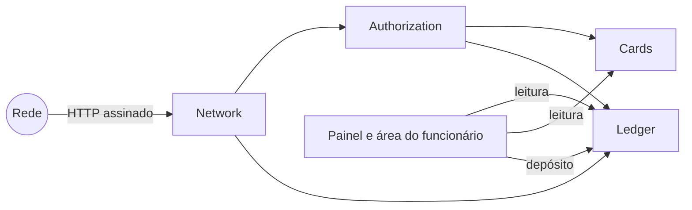
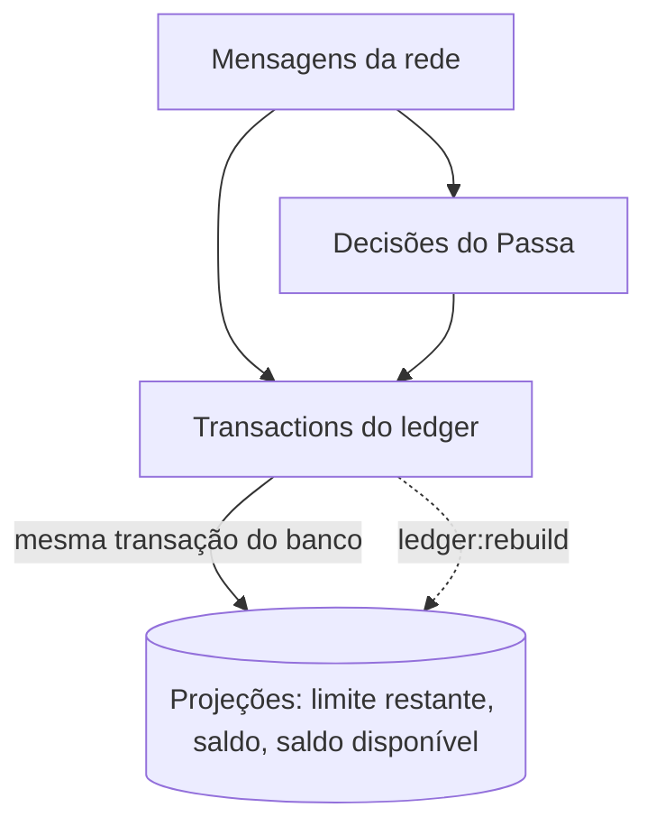
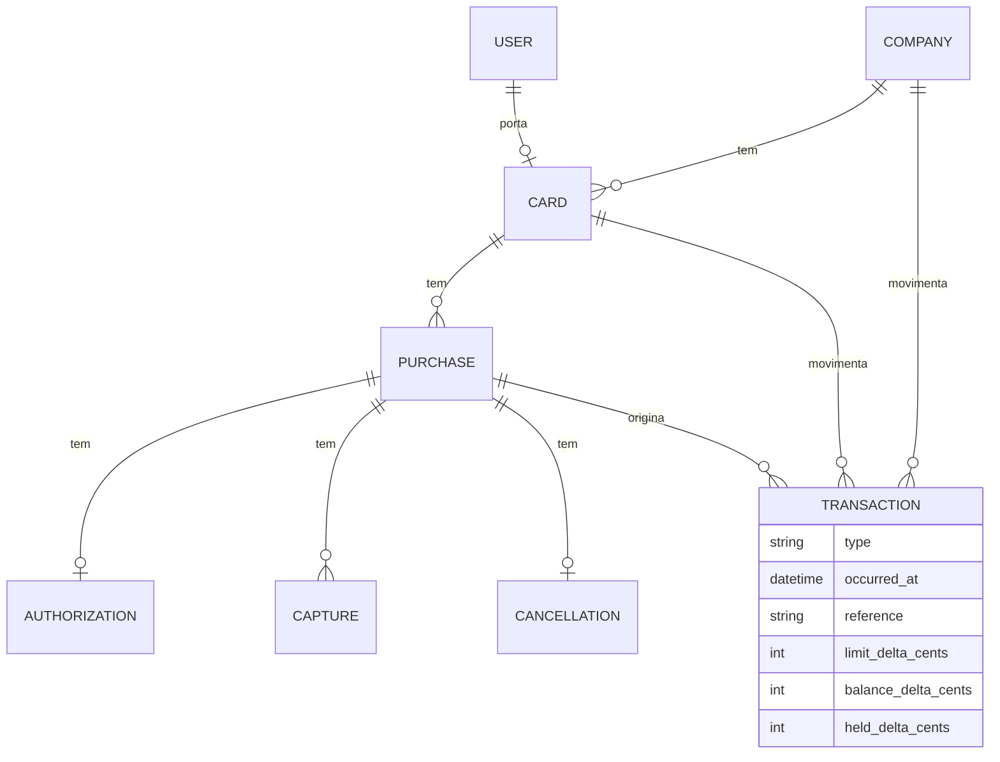

# MODEL.md

Este arquivo é o coração da sua entrega. Escreva-o durante o desafio, não depois.

## 1. O modelo

Diagrama (Mermaid ou imagem) e, para cada coisa que existe nele, uma linha dizendo por que ela existe.

### Base arquitetural

Quatro escolhas sustentam todo o resto do modelo.

- **Monolito modular.** O código se divide por contexto dentro de `app/`: `Network`, `Authorization`, `Ledger` e `Cards`. A interface (Filament e Livewire) só lê. Uso a linguagem do domínio sem camadas extras: Actions de domínio e Eloquent direto.
- **Event sourcing.** A fonte da verdade é um log append-only, e nada nele sofre `UPDATE` ou `DELETE`. Limite restante, saldo e saldo disponível são **projeções**: atualizadas na mesma transação do banco que grava o fato e reconstruíveis a partir do log.
- **Idempotência por constraint única.** Uma mensagem repetida ou reemitida esbarra num índice único do Postgres e recebe a mesma resposta da primeira vez.
- **Lock pessimista.** Toda escrita que mexe em dinheiro trava a empresa e depois o cartão (`SELECT … FOR UPDATE`), sempre nessa ordem.



| Módulo | Por que existe |
|---|---|
| `Network` | Verifica a assinatura, valida o contrato, grava a mensagem como fato imutável e barra duplicatas. Não conhece regra de negócio. |
| `Authorization` | Aplica os motivos de recusa na ordem do enunciado e grava a decisão uma única vez. |
| `Ledger` | Único módulo que cria transactions e atualiza as projeções. |
| `Cards` | Empresa, cartões, portadores e as regras de cada cartão (MCC bloqueado, teto por compra, bloqueio, limite mensal). |

#### O log

O log guarda três tipos de fato:

1. **As mensagens da rede**, como chegaram.
2. **As decisões do Passa** sobre cada authorization.
3. **As transactions do ledger.**

A decisão precisa estar no log porque ela depende do estado do momento em que a authorization foi processada (Etapa 1, regra 4). Se eu guardasse só as mensagens, reprocessá-las em outra ordem poderia inverter uma aprovação. A decisão é um fato do Passa, e não um valor que se recalcula.



#### Uma mensagem, do começo ao fim

```mermaid
sequenceDiagram
    participant R as Rede
    participant N as Network
    participant DB as Postgres
    R->>N: requisição assinada
    N->>N: assinatura (401) e contrato (422)
    N->>DB: BEGIN; INSERT da mensagem ON CONFLICT DO NOTHING
    alt mensagem já registrada
        N->>DB: lê o resultado gravado
        N-->>R: mesma resposta da primeira vez
    else mensagem nova
        N->>DB: trava empresa, depois cartão (FOR UPDATE)
        N->>DB: grava decisão e transactions, atualiza projeções
        N->>DB: COMMIT
        N-->>R: 200 / 202
    end
```

Quando duas entregas da mesma mensagem chegam juntas, a segunda fica bloqueada no índice único até a primeira fazer commit. Depois ela lê a decisão já gravada e responde igual. O índice único resolve as duplicatas; o lock resolve a disputa de compras diferentes pelo mesmo saldo. Como só existe uma empresa, as escritas de dinheiro ficam serializadas. Aceito isso de propósito: cada transação dura milissegundos e cabe com folga no prazo de 2 segundos da rede.

**Regra de durabilidade:** nenhuma resposta `2xx` sai antes do `COMMIT`.

O que considerei e deixei fora da base está na seção 5.

### Entidades



| Entidade | Por que existe |
|---|---|
| `Company` | Dona do saldo. Toda escrita de dinheiro trava esta linha primeiro. |
| `Card` | Limite mensal e regras: MCC bloqueados, teto por compra, bloqueio. Pertence a um portador. |
| `User` | Login da gestora no painel e dos portadores na área do funcionário. |
| `Purchase` | Agrupa tudo o que a rede manda sob o mesmo `authorization_id`. Nasce com a primeira mensagem que citar esse `id`, seja a authorization ou um event. |
| `Authorization` | A mensagem da rede e a decisão do Passa (`decision` e `reason`), gravadas uma única vez. |
| `Capture` | Cada capture recebida, com `sequence` e `final`. Única por compra e `sequence`. |
| `Cancellation` | No máximo uma por compra. |
| `Transaction` | Linha append-only do ledger. Os três deltas dizem o que ela muda no limite do cartão, no saldo e na reserva da empresa. |

As tabelas de mensagem (`Authorization`, `Capture`, `Cancellation`) também guardam o corpo bruto recebido, para auditoria. Como guardar o `id` da rede é a Decisão 9.

## 2. Decisões

As dez decisões do enunciado. Para cada uma: o que você decidiu e o motivo, em duas ou três linhas. Nas que você hesitou, diga também a alternativa que rejeitou e o que pesou. É contra este texto que conferimos o seu sistema nos pontos que o enunciado deixa em aberto.

### Decisão 1 · Como representar authorization, capture, cancellation, compra e transaction

**Mensagens.** Cada tipo de mensagem tem a sua tabela: `authorizations`, `captures` e `cancellations`. Todas ficam ligadas a uma `purchase`, identificada pelo `authorization_id` da rede. A decisão e o `reason` ficam na própria authorization, porque são o fato do Passa sobre aquela mensagem. A compra nasce com a primeira mensagem que a citar. Assim, um event que chega antes da authorization já tem onde morar.

**Transactions.** Uso um ledger único, `transactions`, append-only. Cada linha tem três deltas:

- `limit_delta_cents`: o que a linha muda no limite restante do cartão;
- `balance_delta_cents`: o que muda no saldo da empresa;
- `held_delta_cents`: o que muda na reserva da empresa.

Cada número do sistema é uma soma:

- limite restante = limite mensal + Σ `limit_delta_cents` das compras do cartão no mês;
- saldo = Σ `balance_delta_cents`;
- saldo disponível = saldo − Σ `held_delta_cents`.

O statement do cartão é a coluna `limit_delta_cents` com o saldo corrido, e o statement da empresa é a coluna `balance_delta_cents`.

**Alternativas rejeitadas.**

- **Tabela única de mensagens com `payload jsonb`.** É mais literal como log, mas a unicidade de `(authorization_id, sequence)` dependeria de índices parciais sobre JSON. Com tabelas tipadas, as constraints que barram reemissões (Decisão 10) saem naturais: `captures` única por compra e `sequence`, `cancellations` única por compra.
- **Inbox bruto separado das tabelas tipadas.** Duplicaria dados que as tabelas tipadas já guardam (o corpo bruto vai junto em cada uma).
- **Ledgers separados para cartão e empresa.** Um mesmo fato, como uma capture, viraria duas linhas em tabelas diferentes, que teriam que continuar consistentes entre si. Com uma linha e três deltas, o fato é atômico e o rebuild das projeções é uma soma.

### Decisão 2 · A reserva aparece no statement

Sim. A authorization aprovada gera uma transaction que reserva o valor e já reduz o limite restante. Cada mensagem que mexe em dinheiro gera **exatamente uma** transaction, com o valor líquido em relação à reserva que ela consome. A `reference` é o `id` da mensagem.

| `type` | Origem | `limit_delta` | `balance_delta` | `held_delta` |
|---|---|---|---|---|
| `authorization` | authorization aprovada | −autorizado | 0 | +autorizado |
| `capture` | capture | −(parte da capture que excede a reserva restante) | −capturado | −(reserva consumida) |
| `cancellation` | cancellation | +reserva restante | 0 | −reserva restante |
| `deposit` | depósito no painel | 0 | +depositado | 0 |

Uma authorization recusada não gera transaction, porque não move dinheiro. Ela aparece na história da compra e na lista de recusadas do painel, mas não no statement.

Uma capture que cabe na reserva entra no statement do cartão com `amount_cents` 0. O limite já tinha sido descontado na aprovação, e a capture só troca reserva por cobrança. O painel e a área do funcionário mostram o valor capturado ao lado da linha.

**Alternativas rejeitadas.**

- **Só o capturado no statement.** Para o invariante fechar, o limite restante teria que ignorar as reservas. Logo depois de uma aprovação de 800, a Ana continuaria com 2.000 de limite restante, e uma authorization de 1.500 passaria na regra 5. Isso deixa 2.300 comprometidos num limite de 2.000.
- **Duas linhas por capture (liberação + cobrança).** É mais legível, mas uma mensagem viraria duas transactions com a mesma `reference`, e cada capture encheria o saldo corrido de idas e voltas.

### Decisão 3 · Capture acima do esperado

Aceito a capture pelo valor inteiro e sinalizo a compra como problema. O excedente sai do limite restante e do saldo da empresa. O limite restante pode ficar negativo, como o vocabulário do enunciado prevê.

**Por que aceitar.** A capture não é uma pergunta: é um valor que a rede **já cobrou** do portador e vai liquidar com o Passa (Etapa 2, regra 1). Recusá-la não desfaz a cobrança, só faz o sistema mostrar um saldo que não corresponde ao dinheiro pago.

**O negativo é possível, mas limitado.** Ele só pode nascer de uma cobrança que a rede já fez, nunca de uma aprovação do Passa:

| Origem | Pode gerar negativo? |
|---|---|
| Aprovação do Passa | Não. A regra de recusa (Etapa 1, regra 5) impede. |
| Capture acima do esperado | Sim, e a compra é sinalizada para o financeiro. |
| Compras depois do negativo | Não. Qualquer valor fica acima de um limite restante negativo, então a authorization é recusada com `monthly_limit_exceeded`. Com o saldo disponível da empresa zerado ou negativo, a recusa é `insufficient_funds`. |

O cartão fica travado até o mês seguinte, ou a empresa até um novo depósito, e o financeiro vê o motivo no painel.

**Ordem de chegada.** A capture é aceita sempre, então o saldo final é o mesmo chegue ela antes ou depois da authorization (Etapa 2, regra 5). O sinal de problema não é decidido na chegada da capture: ele é calculado sobre a compra sempre que ela ganha um fato novo, com `capturado × 100 ≤ autorizado × 120` nos MCC 5812, 7011 e 7512 e `capturado ≤ autorizado` nos demais. Uma capture que chega antes da authorization é avaliada quando a authorization chegar.

**Alternativas rejeitadas.**

- **Rejeitar a capture com `4xx`.** O event viraria pendência manual fora do sistema, e o saldo deixaria de refletir o dinheiro pago. Pior: a decisão dependeria da ordem de chegada. Sem a authorization, o Passa não sabe o valor autorizado nem o MCC e aceitaria; com ela, rejeitaria. As mesmas mensagens dariam saldos finais diferentes.
- **Aceitar só até a margem e ignorar o excedente.** Os mesmos dois problemas, em escala menor.

**Meu questionamento.** : Num cartão pré-pago real, deixar o limite ficar negativo me incomoda, e hesitei aqui. Mas o enunciado diz que estes pontos **não têm resposta certa**, e as restrições dele (a capture é um fato consumado e o resultado não pode depender da ordem) fecham as alternativas técnicas. Bloquear isso no sistema seria esconder o problema. Resolver de verdade é mudar a **regra de negócio**, para que a situação não chegue a acontecer. Eu levaria ao produto três caminhos, todos fora do escopo deste desafio:

1. reservar com margem nos MCC com gorjeta ou consumo posterior, como o pré-autorizado de hotel (o quanto a compra reserva é a Decisão 4);
2. negociar com a rede um teto contratual para captures acima do autorizado;
3. definir com a empresa como o excedente é cobrado do portador ou absorvido.

Até lá, o sistema registra a verdade, trava novos gastos e avisa o financeiro.

### Decisão 4 · O que uma compra reserva em cada momento

Cada compra ocupa do limite do cartão, e do saldo disponível da empresa:

> **consumo = total capturado + reserva**
>
> **reserva** = 0 se a compra foi recusada, já recebeu a capture `final: true` ou já recebeu uma cancellation. Senão, é o que falta capturar do valor autorizado, nunca menos que zero.

| Momento | Reserva | Efeito |
|---|---|---|
| Aprovada | o valor autorizado | sai do limite e do saldo disponível |
| Depois de uma capture parcial | autorizado − capturado, mínimo 0 | a capture é debitada do saldo da empresa na hora e consome a reserva no mesmo valor |
| Depois da capture `final: true` | 0 | a capture é debitada, e o que sobrou da reserva volta para o limite e para o saldo disponível |
| Depois de uma cancellation | 0 | o que sobrou da reserva volta |
| Recusada | 0 | nada é reservado |

Cada transaction (Decisão 2) é a diferença dessa conta antes e depois da mensagem. Com autorizado de 800 e captures de 300, 300 e 260 (final), o consumo passa por 800, 800, 800 e 860, e a reserva por 800, 500, 200 e 0.

**Independe da ordem.** Quando a compra fecha, a reserva é zero e o consumo é exatamente o total capturado, seja qual for a ordem das captures. Se a capture final chega antes de uma parcial, ela libera o que sobrou, e a parcial que vem depois sai inteira do limite. O caminho muda, o resultado final não. Uma capture é debitada mesmo sem saldo ou limite para cobri-la (Decisão 3), porque a rede já a cobrou.

**Alternativas rejeitadas.**

- **Reservar autorizado × 120% nos MCC 5812, 7011 e 7512.** Diminuiria a chance de limite negativo, mas a Etapa 1, regra 3, diz que a compra aprovada reserva **o valor autorizado**. Isso é contrato, não decisão. A ideia fica como proposta de mudança de regra de negócio, na Decisão 3.
- **Segurar a sobra da reserva até uma cancellation, depois da capture final.** A rede garante que a capture `final: true` é a última, mas não promete cancellation depois dela. A sobra ficaria presa no limite para sempre.
- **Debitar as captures parciais só quando chegar a final.** Cada capture é dinheiro que a rede já cobrou. Adiar o débito deixaria o saldo da empresa desatualizado, e uma compra que nunca recebe a final nunca seria debitada.

## 3. Riscos e garantias

Os riscos que você identificou neste domínio. Para cada um: o que pode dar errado, o que no seu código impede que aconteça e qual teste prova isso.

## 4. O que eu esperava dos cenários

Antes de implementar, para P2 e P3: o resultado que você espera depois de cada mensagem e por quê, a partir das suas decisões. Depois de rodar: bateu? O que mudou?

## 5. O que mudou e o que foi descartado

Alterações relevantes do modelo ao longo do caminho, com o motivo. E o que o seu primeiro rascunho, ou a IA, propôs e você não aceitou.
