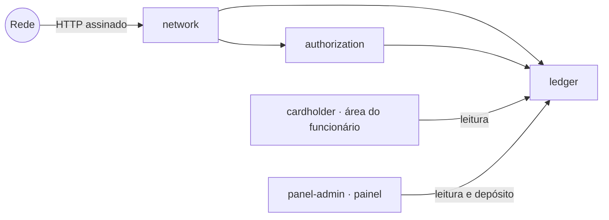
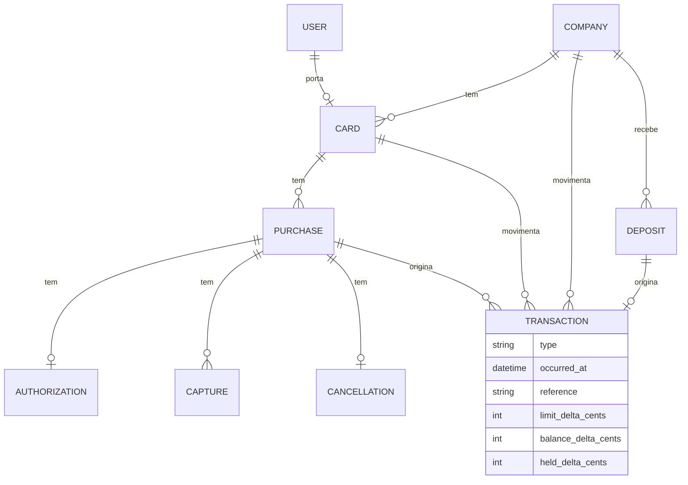

# MODEL.md

Este arquivo é o coração da sua entrega. Escreva-o durante o desafio, não depois.

## 1. O modelo

### Base arquitetural

| Pilar                     | O que significa                                                                                                                                                                                          |
| ------------------------- | -------------------------------------------------------------------------------------------------------------------------------------------------------------------------------------------------------- |
| **Monolito modular**      | Módulos como pacotes Composer em `app-modules/` (`internachi/modular`), namespace `Passa\…`, cada um com migrations, testes e ServiceProvider. Actions de domínio e Eloquent direto, sem camadas extras. |
| **Event sourcing leve**   | Um log append-only é a fonte da verdade: nada sofre `UPDATE` ou `DELETE`. Limite restante, saldo e saldo disponível são projeções, atualizadas na mesma transação e reconstruíveis a partir do log.      |
| **Idempotência no banco** | Mensagem repetida ou reemitida esbarra num índice único do Postgres e recebe a mesma resposta da primeira vez.                                                                                           |
| **Lock pessimista**       | Toda escrita de dinheiro trava a empresa e depois o cartão (`SELECT … FOR UPDATE`), sempre nessa ordem.                                                                                                  |



| Módulo          | Tipo         | Responsabilidade                                                                                        |
| --------------- | ------------ | ------------------------------------------------------------------------------------------------------- |
| `network`       | integração   | Assinatura, contrato com tipos estritos, corpo → DTO, resultado → status HTTP. Sem regra de negócio.    |
| `authorization` | domínio      | Motivos de recusa na ordem do enunciado; grava a decisão uma vez e aplica os events que chegaram antes. |
| `ledger`        | domínio      | Dono das contas e dos fatos. Único módulo que cria transactions e atualiza projeções.                   |
| `cardholder`    | apresentação | Login e `/my-card` do portador (Livewire, Blade, Tailwind, sem Filament).                               |
| `panel-admin`   | apresentação | Painel Filament do financeiro: leitura e depósito.                                                      |

O que é compartilhado (`User`, providers, formatação de dinheiro) fica em `App\`.

- **Contas dentro do `ledger`.** Um módulo `accounts` separado foi descartado: saldo e limite são projeções que só o `Ledger::post()` escreve, e o cartão se relaciona com compras e transactions. Os dois módulos se importariam. Pelo mesmo motivo, os DTOs das mensagens pertencem ao domínio, não à camada HTTP.
- **A direção é testada.** `tests/Arch/ModulesTest.php` proíbe cada módulo de importar os de cima, o domínio de usar HTTP, Livewire ou Filament, e a área do portador de usar Filament (Etapa 5, req. 6). Cada regra foi quebrada de propósito para confirmar que o teste falha.

### O log

Guarda três tipos de fato: **mensagens da rede** (como chegaram), **decisões do Passa** e **transactions do ledger**. A decisão precisa estar no log porque depende do estado do momento (Etapa 1, regra 4): reprocessar só as mensagens em outra ordem poderia inverter uma aprovação.

### Uma mensagem, do começo ao fim

```mermaid
sequenceDiagram
    participant R as Rede
    participant N as Network
    participant DB as Postgres
    R->>N: requisição assinada
    N->>N: assinatura (401) e contrato (422)
    N->>DB: BEGIN; INSERT da mensagem ON CONFLICT DO NOTHING
    alt mensagem já registrada
        N->>DB: lê o resultado gravado
        N-->>R: mesma resposta da primeira vez
    else mensagem nova
        N->>DB: trava empresa, depois cartão (FOR UPDATE)
        N->>DB: grava decisão e transactions, atualiza projeções
        N->>DB: COMMIT
        N-->>R: 200 / 202
    end
```

O índice único resolve duplicatas (a segunda entrega espera o commit da primeira e lê o resultado); o lock resolve a disputa entre compras pelo mesmo saldo. Com uma só empresa, as escritas ficam serializadas — aceito, porque cada transação leva milissegundos frente ao prazo de 2 s.

**Regra de durabilidade:** nenhuma resposta `2xx` sai antes do `COMMIT`.

### Entidades



| Entidade        | Por que existe                                                                                                          |
| --------------- | ----------------------------------------------------------------------------------------------------------------------- |
| `Company`       | Dona do saldo. Toda escrita de dinheiro trava esta linha primeiro.                                                      |
| `Card`          | Limite mensal e regras: MCC bloqueados, teto por compra, bloqueio. Pertence a um portador.                              |
| `User`          | Login da gestora no painel e dos portadores na área do funcionário.                                                     |
| `Purchase`      | Tudo o que a rede manda sob o mesmo `authorization_id`. Nasce com a primeira mensagem que citar esse `id`.              |
| `Authorization` | A mensagem da rede e a decisão do Passa (`decision` e `reason`), gravadas uma única vez.                                |
| `Capture`       | Cada capture recebida, com `sequence` e `final`. Única por compra e `sequence`.                                         |
| `Cancellation`  | No máximo uma por compra.                                                                                               |
| `Deposit`       | Cada depósito feito no painel, com quem depositou. Origem da transaction de tipo `deposit`.                             |
| `Transaction`   | Linha append-only do ledger. Os três deltas dizem o que ela muda no limite do cartão, no saldo e na reserva da empresa. |

As tabelas de mensagem também guardam o corpo bruto recebido, para auditoria.

## 2. Decisões

| #   | Decisão                                                 | Em uma linha                                                                                    |
| --- | ------------------------------------------------------- | ----------------------------------------------------------------------------------------------- |
| 1   | Representação                                           | uma tabela por tipo de mensagem, ligadas à compra; um ledger único com três deltas              |
| 2   | A reserva no statement                                  | sim; cada mensagem que mexe em dinheiro gera exatamente uma transaction                         |
| 3   | Capture acima do esperado                               | aceita inteira e sinaliza a compra; o limite pode ficar negativo                                |
| 4   | O que a compra reserva                                  | consumo = capturado + reserva; a reserva zera quando a compra fecha                             |
| 5   | Compras sinalizadas                                     | quatro motivos, calculados só com os fatos da compra                                            |
| 6   | Event sem authorization; capture depois de cancellation | o event espera a authorization; a capture é aceita, debitada e sinalizada                       |
| 7   | Mês da compra                                           | o mês da authorization, em `America/Sao_Paulo`, para todas as transactions da compra            |
| 8   | Projeção ou recálculo                                   | os dois: projeção no dia a dia, recálculo para verificar e consertar                            |
| 9   | Chaves                                                  | chave própria `bigint`; o `id` da rede numa coluna única                                        |
| 10  | O mesmo fato                                            | entrega repetida pelo `id`; reemissão pela chave natural: `200` se idêntica, `409` se diferente |

### Decisão 1 · Como representar authorization, capture, cancellation, compra e transaction

Cada tipo de mensagem tem a sua tabela (`authorizations`, `captures`, `cancellations`), todas ligadas a uma `purchase` identificada pelo `authorization_id` da rede. A decisão e o `reason` ficam na própria authorization. A compra nasce com a primeira mensagem que a citar, então um event que chega antes da authorization já tem onde morar.

As transactions ficam num ledger único, `transactions`, append-only, com três deltas por linha: `limit_delta_cents` (limite restante do cartão), `balance_delta_cents` (saldo da empresa) e `held_delta_cents` (reserva da empresa). Cada número do sistema é uma soma:

- limite restante = limite mensal + Σ `limit_delta_cents` das compras do cartão no mês;
- saldo = Σ `balance_delta_cents`;
- saldo disponível = saldo − Σ `held_delta_cents`.

**Rejeitadas.**

- **Tabela única de mensagens com `payload jsonb`:** a unicidade de `(authorization_id, sequence)` dependeria de índices parciais sobre JSON.
- **Inbox bruto separado:** duplicaria o que as tabelas tipadas já guardam.
- **Ledgers separados para cartão e empresa:** uma capture viraria duas linhas que precisariam continuar consistentes entre si.

### Decisão 2 · A reserva aparece no statement

Sim. A authorization aprovada gera uma transaction que reserva o valor e já reduz o limite restante. Cada mensagem que mexe em dinheiro gera **exatamente uma** transaction, com o valor líquido em relação à reserva que consome, e a `reference` é o `id` da mensagem.

| `type`          | `limit_delta`                                     | `balance_delta` | `held_delta`         |
| --------------- | ------------------------------------------------- | --------------- | -------------------- |
| `authorization` | −autorizado                                       | 0               | +autorizado          |
| `capture`       | −(parte da capture que excede a reserva restante) | −capturado      | −(reserva consumida) |
| `cancellation`  | +reserva restante                                 | 0               | −reserva restante    |
| `deposit`       | 0                                                 | +depositado     | 0                    |

Uma authorization recusada não gera transaction. Uma capture que cabe na reserva entra no statement com valor 0: o limite já tinha sido descontado na aprovação.

**Rejeitadas.**

- **Só o capturado no statement:** o limite restante teria que ignorar as reservas. Logo depois de aprovar 800, a Ana ainda teria 2.000, e uma authorization de 1.500 passaria: 2.300 comprometidos num limite de 2.000.
- **Duas linhas por capture (liberação + cobrança):** uma mensagem viraria duas transactions com a mesma `reference`.

### Decisão 3 · Capture acima do esperado

Aceito a capture pelo valor inteiro e sinalizo a compra. A capture não é uma pergunta: é um valor que a rede **já cobrou** e vai liquidar (Etapa 2, regra 1). Recusar não desfaz a cobrança, só faz o saldo mentir.

O excedente sai do limite restante e do saldo, e o limite pode ficar negativo. Mas o negativo só nasce de uma cobrança da rede, nunca de uma aprovação do Passa: a regra 5 da Etapa 1 recusa qualquer authorization acima do limite restante. Depois do negativo, toda compra nova é recusada (`monthly_limit_exceeded`, ou `insufficient_funds` se a empresa ficou sem saldo) até o mês virar ou entrar um depósito.

O sinal não é decidido na chegada da capture: é recalculado sobre a compra a cada fato novo (Decisão 5). Assim o resultado não depende da ordem.

**Rejeitadas.**

- **Rejeitar a capture com `4xx`:** o saldo deixaria de refletir o dinheiro pago, e o resultado dependeria da ordem. Sem a authorization, o Passa não sabe o valor autorizado e aceitaria; com ela, rejeitaria.
- **Aceitar só até a margem:** os mesmos dois problemas, em escala menor.

**Meu questionamento.** Num cartão pré-pago real, deixar o limite ficar negativo me incomoda. Mas as restrições do enunciado (a capture é fato consumado e o resultado não pode depender da ordem) fecham as alternativas técnicas, e bloquear no sistema seria esconder o problema. Resolver de verdade é mudar a **regra de negócio**, e eu levaria ao produto três caminhos, fora do escopo: reservar com margem nos MCC com gorjeta, como o pré-autorizado de hotel; negociar com a rede um teto contratual para captures acima do autorizado; e definir com a empresa como o excedente é cobrado do portador. Até lá, o sistema registra a verdade, trava novos gastos e avisa o financeiro.

### Decisão 4 · O que uma compra reserva em cada momento

> **consumo = total capturado + reserva**
>
> **reserva** = 0 se a compra foi recusada, recebeu a capture `final: true` ou uma cancellation. Senão, o que falta capturar do autorizado, nunca menos que zero.

| Momento                         | Reserva                          |
| ------------------------------- | -------------------------------- |
| Aprovada                        | o valor autorizado               |
| Depois de uma capture parcial   | autorizado − capturado, mínimo 0 |
| Depois da capture `final: true` | 0, e a sobra volta               |
| Depois de uma cancellation      | 0, e a sobra volta               |
| Recusada                        | 0                                |

Cada transaction é a diferença dessa conta antes e depois da mensagem. Quando a compra fecha, a reserva é zero e o consumo é exatamente o capturado, em qualquer ordem: se a final chega antes de uma parcial, ela libera a sobra, e a parcial que vem depois sai inteira do limite.

**Rejeitadas.**

- **Reservar autorizado × 120% nos MCC 5812, 7011 e 7512:** a Etapa 1, regra 3, diz que a compra reserva o valor autorizado. Ficou como proposta de negócio (Decisão 3).
- **Segurar a sobra até uma cancellation:** a rede não promete cancellation depois da final, e a sobra ficaria presa para sempre.
- **Debitar as parciais só na final:** o saldo ficaria desatualizado, e uma compra sem final nunca seria debitada.

### Decisão 5 · Compras sinalizadas como problema

O sinal depende só dos fatos da própria compra e das regras fixas do cartão, nunca de outras compras nem da ordem de chegada. É recalculado a cada fato novo, e uma compra pode ter mais de um motivo.

| Motivo                        | Quando                                                                                                             |
| ----------------------------- | ------------------------------------------------------------------------------------------------------------------ |
| `over_capture`                | `capturado × 100 > autorizado × 120` nos MCC 5812, 7011 e 7512, ou `capturado > autorizado` nos demais             |
| `over_purchase_limit`         | o cartão tem teto por compra e o total capturado passa dele                                                        |
| `captured_when_declined`      | a compra tem capture, mas a authorization foi recusada: saiu dinheiro sem aprovação                                |
| `captured_after_cancellation` | uma capture tem `occurred_at` posterior ao da cancellation, comparando o horário do fato na rede, não o da chegada |

**Não sinalizo** a compra que deixou o limite negativo (qual compra "deixou" depende da ordem; o negativo aparece no cartão), os events sem authorization (têm lista própria no painel) nem a authorization recusada sem capture (é o sistema funcionando).

**Pesei não sinalizar** a capture acima do teto quando ela está dentro da margem da rede, já que a gorjeta dentro da margem é esperada. Decidi sinalizar: o teto é um limite que a empresa definiu, e passar dele precisa chegar ao financeiro. Com isso, o P2 é sinalizado.

### Decisão 6 · Event sem authorization e capture depois de cancellation

**Event antes da authorization.** O event não traz `card_token`, então sem a authorization o Passa não sabe de que cartão é a compra. O event é aceito (`202`) e gravado, sem transaction. Quando a authorization chega, na mesma transação do banco:

1. o Passa decide com o estado do momento, **sem contar os events da própria compra**;
2. grava a decisão;
3. aplica os events pendentes em ordem de `occurred_at`, cada um com a sua transaction.

Se a compra já recebeu a final ou uma cancellation, a aprovação reserva zero. Se a authorization for recusada e houver captures, elas são debitadas e a compra é sinalizada (`captured_when_declined`). Até a authorization chegar, a compra aparece na lista de events sem authorization e não conta no saldo.

Exemplo: capture final de 100 na Ana antes da authorization de 100. A capture é gravada sem transaction (limite 2.000, saldo 10.000). A authorization aprova, reserva zero e aplica a capture (1.900 e 9.900). Na ordem inversa, o resultado é o mesmo.

**Capture depois de cancellation.** Aceita e debitada inteira, porque a cancellation já zerou a reserva, e a compra é sinalizada (`captured_after_cancellation`).

**Rejeitadas.**

- **Debitar o saldo na chegada do event e o limite depois:** um event viraria duas transactions (contra a Decisão 2).
- **Contar as captures já recebidas na decisão:** poderia recusar uma compra que a rede já cobrou, e a decisão dependeria da ordem.
- **Rejeitar com `4xx` a capture depois de cancellation:** chegando antes da cancellation, a mesma capture seria aceita.

**Risco aceito.** Uma authorization que não chega ao Passa é tratada pela rede como recusada e seguida de cancellation, então a compra órfã esperada é só uma cancellation, sem dinheiro. Uma capture órfã para sempre seria erro da rede: fica visível no painel, mas fora do saldo.

### Decisão 7 · Mês de uma compra

A compra pertence ao mês do `occurred_at` da **authorization**, em `America/Sao_Paulo`, e todas as transactions dela contam nesse mês, mesmo as que chegam depois. O mês fica gravado na compra quando a authorization chega. Uma authorization de hotel em 30/09 com capture final em 02/10 conta inteira em setembro.

- Uma authorization offline de setembro que chega em outubro é decidida contra o limite de setembro e entra no statement de setembro.
- A compra fica inteira num statement só, e a reserva é consumida no mesmo mês em que foi feita.
- O saldo da empresa não é mensal: a reserva aberta de um mês passado continua segurando o saldo disponível.
- `2026-10-01T01:00:00Z` é 30/09 às 22h em São Paulo, então conta em setembro.

**Rejeitadas.**

- **Cada transaction no mês do próprio `occurred_at`:** uma reserva de setembro seria consumida em outubro, e o enunciado atribui **compras** a um mês.
- **Mês da primeira capture:** na chegada da authorization ainda não há capture para decidir contra qual mês.

### Decisão 8 · Projeção e recálculo

**Projeção, no dia a dia.** Saldo e total reservado ficam na própria linha da empresa, e o limite consumido fica numa linha por cartão e mês. As duas são atualizadas na mesma transação que grava a transaction. A authorization, o `/available`, o painel e a área do funcionário leem a projeção, e a linha da empresa é a mesma que o lock trava.

**Recálculo, para verificar e consertar.** O statement sempre soma o ledger linha a linha, então cada consulta compara as duas fontes pelo invariante da Etapa 3. O comando `ledger:rebuild` reconstrói as projeções a partir do ledger, e `ledger:rebuild --check` só aponta divergência.

**Rejeitadas.**

- **Só recalcular:** cada authorization somaria o ledger do mês dentro do lock, e o custo cresceria com o volume.
- **Só projeção:** um bug que atualizasse a projeção errado passaria despercebido e não teria conserto.

### Decisão 9 · Chaves internas

Toda tabela tem chave própria (`bigint`), e o `id` da rede fica numa coluna com índice único: `purchases.network_authorization_id` e `network_id` em `authorizations`, `captures` e `cancellations`. Em `transactions`, a `reference` é o `id` da mensagem, e uma chave única na mensagem de origem garante no banco que uma mensagem gera no máximo uma transaction. O `id` sequencial do ledger dá a ordem estável que o statement usa.

A chave sequencial não é proteção de acesso, e nem precisa ser: nenhuma rota nem ação da área do funcionário recebe o `id` de uma compra ou de um cartão. Tudo parte do cartão do usuário logado (Etapa 5, requisito 4).

**Rejeitadas.**

- **O `id` da rede como chave primária:** os depósitos não têm `id` da rede, e o enunciado não garante que um `id` de authorization nunca coincida com um de event.
- **UUID:** perde a ordem natural do ledger e não protege nada que o escopo pelo usuário já não proteja.

### Decisão 10 · Reconhecer o mesmo fato

|          | Entrega repetida   | Reemissão                                                                         |
| -------- | ------------------ | --------------------------------------------------------------------------------- |
| `id`     | igual              | diferente                                                                         |
| Conteúdo | idêntico           | idêntico, exceto o `id`                                                           |
| Chave    | `network_id` único | chave natural: `captures (purchase_id, sequence)` e `cancellations (purchase_id)` |

As chaves naturais vêm das garantias da rede (sequences sem repetição, no máximo uma cancellation por compra) e valem também para events que chegam antes da authorization.

| Situação                                   | Resposta                                                                                     |
| ------------------------------------------ | -------------------------------------------------------------------------------------------- |
| Mensagem nova                              | grava; a decisão para authorization, `202` para event                                        |
| Entrega repetida                           | a resposta original, lida do que foi gravado                                                 |
| Reemissão com conteúdo idêntico            | `200`, sem gravar; a `reference` continua sendo o `id` da primeira mensagem                  |
| Mesma chave natural com conteúdo diferente | `409`. A rede garante que não acontece; se acontecer, é inconsistência que precisa de alguém |

Na comparação entram todos os campos do contrato menos o `id`.

**Rejeitada.**

- **Fingerprint do conteúdo com índice único:** duas captures com a mesma `sequence` e valores diferentes teriam fingerprints diferentes, entrariam as duas, e a compra seria cobrada em dobro.

## 3. Riscos e garantias

Cada risco tem o que o impede e o teste que prova. Os testes ficam em `app-modules/*/tests` e, os que cruzam módulos, em `tests/`.

### Dinheiro e concorrência

| Risco                                                            | O que impede                                                                                          | Teste                                                                                                                  |
| ---------------------------------------------------------------- | ----------------------------------------------------------------------------------------------------- | ---------------------------------------------------------------------------------------------------------------------- |
| **Aprovar acima do limite em paralelo**                          | decisão e gravação na mesma transação, com `FOR UPDATE` na empresa e depois no cartão                 | `ConcurrentAuthorizationTest`: 8 authorizations em processos paralelos; sem os locks, todas eram aprovadas             |
| **Saldo perdido entre cartões em paralelo**, ou **deadlock**     | todos os caminhos travam na mesma ordem: empresa, depois cartão                                       | `ConcurrentEventsTest`: events e authorizations de três cartões disputando o saldo; sem o lock da empresa, falhava 3/3 |
| **Responder antes do commit**                                    | a resposta só é montada depois que `DB::transaction` retorna; nada que mexe em dinheiro vai para fila | _teste pendente: falha forçada no meio da gravação, sem nenhum registro e com a nova entrega processada_               |
| **Responder depois de 2 segundos**, e a rede mandar cancellation | transações curtas, sem I/O externo dentro do lock; a cancellation libera a reserva (Decisão 4)        | `RecordEventTest`: _releases the hold on a cancellation_                                                               |
| **Centavos perdidos**                                            | valores inteiros em centavos; margem comparada só com inteiros                                        | `PurchaseFlagsTest`: 120,00 sobre 100,00 não é sinalizado, e 120,01 é                                                  |

### Mensagens repetidas e fora de ordem

| Risco                                      | O que impede                                                    | Teste                                                                                                                     |
| ------------------------------------------ | --------------------------------------------------------------- | ------------------------------------------------------------------------------------------------------------------------- |
| **Entrega repetida reservando em dobro**   | índice único em `network_id`; a repetição lê a resposta gravada | `AuthorizePurchaseTest`: _returns the stored response to a repeated delivery_; `ConcurrentAuthorizationTest`, em paralelo |
| **Reemissão cobrando em dobro**            | chaves naturais com comparação de conteúdo (Decisão 10)         | `ReissuedEventsTest`: `200` para a idêntica, `409` para a diferente                                                       |
| **Uma mensagem gerando duas transactions** | chave única em `transactions` na mensagem de origem (Decisão 9) | `LedgerSchemaTest`: _allows only one transaction per source message_                                                      |
| **Resultado dependente da ordem**          | Decisões 4, 5 e 6                                               | `PendingEventsTest`: as 24 ordens de uma compra; `ShuffledReplayTest`: 27 mensagens em 12 ordens, e o rebuild             |

### Ledger e consultas

| Risco                                        | O que impede                                                               | Teste                                                                                          |
| -------------------------------------------- | -------------------------------------------------------------------------- | ---------------------------------------------------------------------------------------------- |
| **Invariante do statement quebrado**         | o statement soma o ledger; o `/available` lê a projeção da mesma transação | `CardStatementTest` e os cenários publicados, com `assertStatementInvariant`                   |
| **Projeção divergindo do ledger**            | projeção atualizada só pelo `ledger`; `ledger:rebuild` reconstrói          | `RebuildLedgerTest`: _finds no drift after the live writes_ e _rebuilds corrupted projections_ |
| **Transaction alterada ou apagada**          | trigger `transactions_append_only` no Postgres e guarda no model           | `LedgerSchemaTest`: _refuses updates and deletes to transactions in the database_              |
| **Compra no mês errado perto da meia-noite** | `occurred_at` convertido para `America/Sao_Paulo` (Decisão 7)              | `AuthorizePurchaseTest`: _attributes the purchase to its month in America/Sao_Paulo_           |
| **Horário deslocado pelo fuso do banco**     | a sessão do Postgres fixada em UTC (`config/database.php`; seção 5)        | `LedgerSchemaTest`: _reads network times back exactly as they were written_                    |

### Rede e contrato

| Risco                                       | O que impede                                                                                        | Teste                                                                                       |
| ------------------------------------------- | --------------------------------------------------------------------------------------------------- | ------------------------------------------------------------------------------------------- |
| **Requisição forjada ou reenviada**         | HMAC-SHA256 sobre o corpo bruto com `hash_equals`, janela de 5 minutos, antes de qualquer validação | `SignatureTest`: ausente, inválida ou fora da janela dá `401`, inclusive com corpo inválido |
| **Tipo frouxo aceito** (`"12990"`, `129.9`) | validação de tipo JSON estrito; a regra `integer` do Laravel aceita string numérica                 | `ContractValidationTest`: cada campo com o tipo errado dá `422`                             |

### Acesso

| Risco                                        | O que impede                                                                                                                | Teste                                                                                                                              |
| -------------------------------------------- | --------------------------------------------------------------------------------------------------------------------------- | ---------------------------------------------------------------------------------------------------------------------------------- |
| **Portador no painel** (o template liberava) | `canAccessPanel` aceita só a gestora                                                                                        | `PanelAccessTest`: `403`                                                                                                           |
| **Portador vendo dados de outro**            | tudo parte do cartão do usuário logado; o componente não guarda `id` no estado público nem tem método que receba uma compra | `CardholderIsolationTest`: nada do Bruno na tela da Ana, parâmetros de URL ignorados, paginação presa ao cartão, métodos recusados |
| **Usuário sem cartão em `/my-card`**         | a rota exige cartão                                                                                                         | `CardholderAuthTest`: a Marina recebe `403`                                                                                        |

## 4. O que eu esperava dos cenários

### Antes de implementar

Ponto de partida, pelo seed: empresa com R$ 10.000,00 e nada reservado. O disponível do Diego acompanha o saldo disponível da empresa, porque o limite dele (R$ 50.000,00) é maior que todo o saldo. É o que o P1 mostra: limite restante de 5000000 e disponível de 943000.

#### P2 · Ana (limite R$ 2.000,00, teto R$ 800,00), MCC 7011

| #   | Mensagem                              | Decisão    | Ana: limite restante | Ana: disponível | Diego: disponível | Saldo da empresa | Reservado | Sinalizada                 |
| --- | ------------------------------------- | ---------- | -------------------: | --------------: | ----------------: | ---------------: | --------: | -------------------------- |
| 1   | authorization 800,00                  | `approved` |             1.200,00 |        1.200,00 |          9.200,00 |        10.000,00 |    800,00 | não                        |
| 2   | capture 300,00, `sequence` 1          | —          |             1.200,00 |        1.200,00 |          9.200,00 |         9.700,00 |    500,00 | não                        |
| 3   | capture 300,00, `sequence` 2          | —          |             1.200,00 |        1.200,00 |          9.200,00 |         9.400,00 |    200,00 | não                        |
| 4   | capture 260,00, `sequence` 3, `final` | —          |             1.140,00 |        1.140,00 |          9.140,00 |         9.140,00 |      0,00 | sim, `over_purchase_limit` |

800,00 é igual ao teto, e não acima: aprovada. As captures parciais trocam reserva por cobrança, e o limite não muda. A final consome os 200,00 restantes, e os 60,00 excedentes saem do limite. Total de 860,00: dentro da margem do MCC 7011, mas acima do teto (Decisão 5). O limite restante do Diego fica em 50.000,00 o tempo todo.

Statement da Ana: −80000 → 120000 · 0 → 120000 · 0 → 120000 · −6000 → 114000.

#### P3 · Bruno (limite R$ 500,00, sem teto), MCC 5812

| #   | Mensagem                | Decisão                              | Bruno: limite restante | Bruno: disponível | Diego: disponível | Saldo da empresa | Reservado | Sinalizada |
| --- | ----------------------- | ------------------------------------ | ---------------------: | ----------------: | ----------------: | ---------------: | --------: | ---------- |
| 1   | authorization 400,00    | `approved`                           |                 100,00 |            100,00 |          9.600,00 |        10.000,00 |    400,00 | não        |
| 2   | capture 480,00, `final` | —                                    |                  20,00 |             20,00 |          9.520,00 |         9.520,00 |      0,00 | não        |
| 3   | authorization 50,00     | `declined`, `monthly_limit_exceeded` |                  20,00 |             20,00 |          9.520,00 |         9.520,00 |      0,00 | não        |
| 4   | authorization 20,00     | `approved`                           |                   0,00 |              0,00 |          9.500,00 |         9.520,00 |     20,00 | não        |

A capture de 480,00 é exatamente 20% acima (48000 × 100 = 40000 × 120), e a margem é inclusiva: não sinalizada. 50,00 passa dos 20,00 restantes: recusada, sem transaction. 20,00 é igual ao limite restante: aprovada.

Statement do Bruno: −40000 → 10000 · −8000 → 2000 · −2000 → 0. A recusada não aparece.

#### P1, para conferência

570,00 capturados na Ana, sem reserva aberta. Ana: 143000 de limite restante e de disponível. Diego: 5000000 e 943000.

### Depois de rodar

Bateu. Os três cenários rodam pela API assinada, como a rede faz, e conferem cada número das tabelas acima, inclusive o statement e o invariante:

- `PublishedScenariosTest`: _matches the published result of P1_, _matches the MODEL.md prediction for P2_ e _for P3_;
- `RecordEventTest`: _follows P2 message by message_ e _follows P3 message by message_, linha a linha das tabelas.

## 5. O que mudou e o que foi descartado

Usei IA durante todo o desafio como par de discussão. Não aceitei um rascunho pronto deste arquivo: decidi cada um dos dez pontos separadamente, comparando as opções antes de escrever.

### O que mudou no caminho

- **Event sourcing.** Comecei pensando em event sourcing completo, com snapshots, achando que ele resolveria as mensagens repetidas em concorrência. Não resolve: quem impede duplicata e corrida é o índice único e o lock, que viraram pilares próprios. Projeções assíncronas quebrariam a decisão com o estado do momento e o prazo de 2 segundos. Fiquei com o padrão sem a cerimônia. Na discussão apareceu o que eu não tinha considerado: o log precisa guardar as **decisões**, não só as mensagens.
- **DDD.** Fiquei com a versão leve: módulos por contexto e linguagem do domínio, com Actions e Eloquent direto, sem repositórios.
- **Módulos por pasta → pacotes.** Comecei com pastas em `app/`. Depois de ler um repositório público da 3Pontos, migrei para o `internachi/modular`, o padrão que eles usam. É a biblioteca de infraestrutura que acrescentei ao template: cada módulo vira um pacote com fronteira explícita, migrations e testes ficam junto do código, e nada muda em tempo de execução. Migrei um módulo por commit, e os mesmos 238 testes passaram em cada passo. A divisão revelou dois ciclos que as pastas escondiam, resolvidos como na seção 1.
- **Limite negativo (Decisão 3).** Meu instinto foi cancelar o excedente e avisar o financeiro. Não funciona: quem envia cancellation é a rede, e a capture chega quando o valor já foi cobrado.
- **Reservar com margem (Decisão 4).** Descartei porque a Etapa 1, regra 3, define que a compra reserva o valor autorizado. Ficou como proposta de negócio.

### Encontrado na implementação

**Fuso da sessão do Postgres.** Os testes de reemissão falharam ao comparar o `occurred_at` de duas captures idênticas. O Postgres local roda com `TimeZone = America/Sao_Paulo`, o Laravel grava sem fuso, e o horário voltava com três horas de diferença. Isso teria deslocado o statement conforme o servidor. A conexão passou a fixar a sessão em UTC, com um teste.

### Onde não aceitei a proposta da IA

**Capture acima do teto dentro da margem (Decisão 5).** A IA recomendou não sinalizar: o teto é checado na authorization, e sinalizar o normal encheria o painel de alertas. Decidi sinalizar, porque o teto é uma regra que a empresa definiu. Com isso, o P2 passou a ser sinalizado.

### Descartado

| Descartado                                           | Motivo                                                               |
| ---------------------------------------------------- | -------------------------------------------------------------------- |
| Projeções assíncronas, por fila                      | a decisão precisa do estado exato do momento                         |
| Event store genérico ou biblioteca de event sourcing | infraestrutura a mais; o padrão cabe em tabelas append-only          |
| Snapshots de agregados                               | otimização de replay para volumes grandes, sem ganho aqui            |
| `CHECKPOINT` e snapshots contra falha de disco       | não protegem contra isso; durabilidade física é infraestrutura       |
| DDD com repositórios e camadas de infraestrutura     | briga com o Laravel idiomático e com o preset de arquitetura do Pest |
| Módulo `accounts` separado do `ledger`               | os dois módulos se importariam (seção 1)                             |

### Portas que o modelo deixa abertas

- **Estorno:** um novo `type` de transaction com os deltas invertidos, sem alterar nada do que existe.
- **Outras empresas:** cartões e transactions já pertencem a uma empresa, e o lock já é por empresa. Várias empresas paralelizariam naturalmente.
- **Fechamento do mês:** cada compra já tem o seu mês. Fechar seria impedir que um mês ganhe transactions novas.
- **Moeda estrangeira:** `currency` é validada como `BRL` e o corpo bruto é guardado, mas os valores não têm moeda própria.
