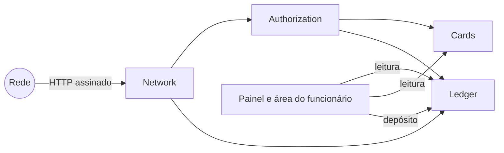
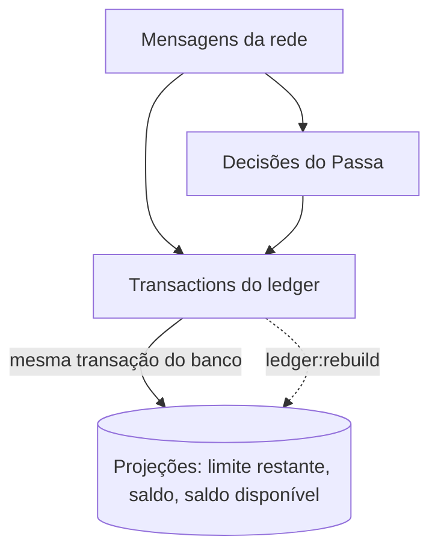
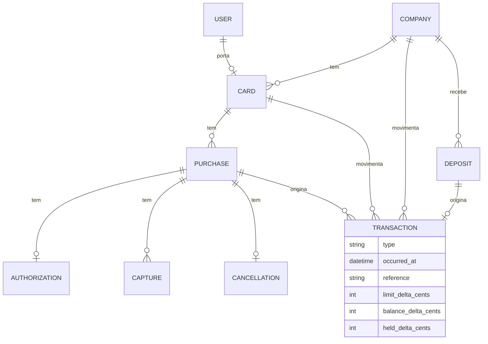

# MODEL.md

Este arquivo é o coração da sua entrega. Escreva-o durante o desafio, não depois.

## 1. O modelo

### Base arquitetural

Quatro escolhas sustentam todo o resto do modelo.

- **Monolito modular.** O código se divide por contexto dentro de `app/`: `Network`, `Authorization`, `Ledger` e `Cards`. A interface (Filament e Livewire) só lê. Uso a linguagem do domínio sem camadas extras: Actions de domínio e Eloquent direto.
- **Event sourcing.** A fonte da verdade é um log append-only, e nada nele sofre `UPDATE` ou `DELETE`. Limite restante, saldo e saldo disponível são **projeções**: atualizadas na mesma transação do banco que grava o fato e reconstruíveis a partir do log.
- **Idempotência por constraint única.** Uma mensagem repetida ou reemitida esbarra num índice único do Postgres e recebe a mesma resposta da primeira vez.
- **Lock pessimista.** Toda escrita que mexe em dinheiro trava a empresa e depois o cartão (`SELECT … FOR UPDATE`), sempre nessa ordem.



| Módulo          | Por que existe                                                                                                                  |
| --------------- | ------------------------------------------------------------------------------------------------------------------------------- |
| `Network`       | Verifica a assinatura, valida o contrato, grava a mensagem como fato imutável e barra duplicatas. Não conhece regra de negócio. |
| `Authorization` | Aplica os motivos de recusa na ordem do enunciado e grava a decisão uma única vez.                                              |
| `Ledger`        | Único módulo que cria transactions e atualiza as projeções.                                                                     |
| `Cards`         | Empresa, cartões, portadores e as regras de cada cartão (MCC bloqueado, teto por compra, bloqueio, limite mensal).              |

#### O log

O log guarda três tipos de fato:

1. **As mensagens da rede**, como chegaram.
2. **As decisões do Passa** sobre cada authorization.
3. **As transactions do ledger.**

A decisão precisa estar no log porque ela depende do estado do momento em que a authorization foi processada (Etapa 1, regra 4). Se eu guardasse só as mensagens, reprocessá-las em outra ordem poderia inverter uma aprovação. A decisão é um fato do Passa, e não um valor que se recalcula.



#### Uma mensagem, do começo ao fim

```mermaid
sequenceDiagram
    participant R as Rede
    participant N as Network
    participant DB as Postgres
    R->>N: requisição assinada
    N->>N: assinatura (401) e contrato (422)
    N->>DB: BEGIN; INSERT da mensagem ON CONFLICT DO NOTHING
    alt mensagem já registrada
        N->>DB: lê o resultado gravado
        N-->>R: mesma resposta da primeira vez
    else mensagem nova
        N->>DB: trava empresa, depois cartão (FOR UPDATE)
        N->>DB: grava decisão e transactions, atualiza projeções
        N->>DB: COMMIT
        N-->>R: 200 / 202
    end
```

Quando duas entregas da mesma mensagem chegam juntas, a segunda fica bloqueada no índice único até a primeira fazer commit. Depois ela lê a decisão já gravada e responde igual. O índice único resolve as duplicatas; o lock resolve a disputa de compras diferentes pelo mesmo saldo. Como só existe uma empresa, as escritas de dinheiro ficam serializadas. Aceito isso de propósito: cada transação dura milissegundos e cabe com folga no prazo de 2 segundos da rede.

**Regra de durabilidade:** nenhuma resposta `2xx` sai antes do `COMMIT`.

O que considerei e deixei fora da base está na seção 5.

### Entidades



| Entidade        | Por que existe                                                                                                                                      |
| --------------- | --------------------------------------------------------------------------------------------------------------------------------------------------- |
| `Company`       | Dona do saldo. Toda escrita de dinheiro trava esta linha primeiro.                                                                                  |
| `Card`          | Limite mensal e regras: MCC bloqueados, teto por compra, bloqueio. Pertence a um portador.                                                          |
| `User`          | Login da gestora no painel e dos portadores na área do funcionário.                                                                                 |
| `Purchase`      | Agrupa tudo o que a rede manda sob o mesmo `authorization_id`. Nasce com a primeira mensagem que citar esse `id`, seja a authorization ou um event. |
| `Authorization` | A mensagem da rede e a decisão do Passa (`decision` e `reason`), gravadas uma única vez.                                                            |
| `Capture`       | Cada capture recebida, com `sequence` e `final`. Única por compra e `sequence`.                                                                     |
| `Cancellation`  | No máximo uma por compra.                                                                                                                           |
| `Deposit`       | Cada depósito feito no painel, com quem depositou. É a origem da transaction de tipo `deposit`.                                                     |
| `Transaction`   | Linha append-only do ledger. Os três deltas dizem o que ela muda no limite do cartão, no saldo e na reserva da empresa.                             |

As tabelas de mensagem (`Authorization`, `Capture`, `Cancellation`) também guardam o corpo bruto recebido, para auditoria. Como guardar o `id` da rede é a Decisão 9.

## 2. Decisões

### Decisão 1 · Como representar authorization, capture, cancellation, compra e transaction

**Mensagens.** Cada tipo de mensagem tem a sua tabela: `authorizations`, `captures` e `cancellations`. Todas ficam ligadas a uma `purchase`, identificada pelo `authorization_id` da rede. A decisão e o `reason` ficam na própria authorization, porque são o fato do Passa sobre aquela mensagem. A compra nasce com a primeira mensagem que a citar. Assim, um event que chega antes da authorization já tem onde morar.

**Transactions.** Uso um ledger único, `transactions`, append-only. Cada linha tem três deltas:

- `limit_delta_cents`: o que a linha muda no limite restante do cartão;
- `balance_delta_cents`: o que muda no saldo da empresa;
- `held_delta_cents`: o que muda na reserva da empresa.

Cada número do sistema é uma soma:

- limite restante = limite mensal + Σ `limit_delta_cents` das compras do cartão no mês;
- saldo = Σ `balance_delta_cents`;
- saldo disponível = saldo − Σ `held_delta_cents`.

O statement do cartão é a coluna `limit_delta_cents` com o saldo corrido, e o statement da empresa é a coluna `balance_delta_cents`.

**Alternativas rejeitadas.**

- **Tabela única de mensagens com `payload jsonb`.** É mais literal como log, mas a unicidade de `(authorization_id, sequence)` dependeria de índices parciais sobre JSON. Com tabelas tipadas, as constraints que barram reemissões (Decisão 10) saem naturais: `captures` única por compra e `sequence`, `cancellations` única por compra.
- **Inbox bruto separado das tabelas tipadas.** Duplicaria dados que as tabelas tipadas já guardam (o corpo bruto vai junto em cada uma).
- **Ledgers separados para cartão e empresa.** Um mesmo fato, como uma capture, viraria duas linhas em tabelas diferentes, que teriam que continuar consistentes entre si. Com uma linha e três deltas, o fato é atômico e o rebuild das projeções é uma soma.

### Decisão 2 · A reserva aparece no statement

Sim. A authorization aprovada gera uma transaction que reserva o valor e já reduz o limite restante. Cada mensagem que mexe em dinheiro gera **exatamente uma** transaction, com o valor líquido em relação à reserva que ela consome. A `reference` é o `id` da mensagem.

| `type`          | Origem                 | `limit_delta`                                     | `balance_delta` | `held_delta`         |
| --------------- | ---------------------- | ------------------------------------------------- | --------------- | -------------------- |
| `authorization` | authorization aprovada | −autorizado                                       | 0               | +autorizado          |
| `capture`       | capture                | −(parte da capture que excede a reserva restante) | −capturado      | −(reserva consumida) |
| `cancellation`  | cancellation           | +reserva restante                                 | 0               | −reserva restante    |
| `deposit`       | depósito no painel     | 0                                                 | +depositado     | 0                    |

Uma authorization recusada não gera transaction, porque não move dinheiro. Ela aparece na história da compra e na lista de recusadas do painel, mas não no statement.

Uma capture que cabe na reserva entra no statement do cartão com `amount_cents` 0. O limite já tinha sido descontado na aprovação, e a capture só troca reserva por cobrança. O painel e a área do funcionário mostram o valor capturado ao lado da linha.

**Alternativas rejeitadas.**

- **Só o capturado no statement.** Para o invariante fechar, o limite restante teria que ignorar as reservas. Logo depois de uma aprovação de 800, a Ana continuaria com 2.000 de limite restante, e uma authorization de 1.500 passaria na regra 5. Isso deixa 2.300 comprometidos num limite de 2.000.
- **Duas linhas por capture (liberação + cobrança).** É mais legível, mas uma mensagem viraria duas transactions com a mesma `reference`, e cada capture encheria o saldo corrido de idas e voltas.

### Decisão 3 · Capture acima do esperado

Aceito a capture pelo valor inteiro e sinalizo a compra como problema. O excedente sai do limite restante e do saldo da empresa. O limite restante pode ficar negativo, como o vocabulário do enunciado prevê.

**Por que aceitar.** A capture não é uma pergunta: é um valor que a rede **já cobrou** do portador e vai liquidar com o Passa (Etapa 2, regra 1). Recusá-la não desfaz a cobrança, só faz o sistema mostrar um saldo que não corresponde ao dinheiro pago.

**O negativo é possível, mas limitado.** Ele só pode nascer de uma cobrança que a rede já fez, nunca de uma aprovação do Passa:

| Origem                     | Pode gerar negativo?                                                                                                                                                                                                 |
| -------------------------- | -------------------------------------------------------------------------------------------------------------------------------------------------------------------------------------------------------------------- |
| Aprovação do Passa         | Não. A regra de recusa (Etapa 1, regra 5) impede.                                                                                                                                                                    |
| Capture acima do esperado  | Sim, e a compra é sinalizada para o financeiro.                                                                                                                                                                      |
| Compras depois do negativo | Não. Qualquer valor fica acima de um limite restante negativo, então a authorization é recusada com `monthly_limit_exceeded`. Com o saldo disponível da empresa zerado ou negativo, a recusa é `insufficient_funds`. |

O cartão fica travado até o mês seguinte, ou a empresa até um novo depósito, e o financeiro vê o motivo no painel.

**Ordem de chegada.** A capture é aceita sempre, então o saldo final é o mesmo chegue ela antes ou depois da authorization (Etapa 2, regra 5). O sinal de problema não é decidido na chegada da capture: ele é calculado sobre a compra sempre que ela ganha um fato novo, com `capturado × 100 ≤ autorizado × 120` nos MCC 5812, 7011 e 7512 e `capturado ≤ autorizado` nos demais. Uma capture que chega antes da authorization é avaliada quando a authorization chegar.

**Alternativas rejeitadas.**

- **Rejeitar a capture com `4xx`.** O event viraria pendência manual fora do sistema, e o saldo deixaria de refletir o dinheiro pago. Pior: a decisão dependeria da ordem de chegada. Sem a authorization, o Passa não sabe o valor autorizado nem o MCC e aceitaria; com ela, rejeitaria. As mesmas mensagens dariam saldos finais diferentes.
- **Aceitar só até a margem e ignorar o excedente.** Os mesmos dois problemas, em escala menor.

**Meu questionamento.** : Num cartão pré-pago real, deixar o limite ficar negativo me incomoda, e hesitei aqui. Mas o enunciado diz que estes pontos **não têm resposta certa**, e as restrições dele (a capture é um fato consumado e o resultado não pode depender da ordem) fecham as alternativas técnicas. Bloquear isso no sistema seria esconder o problema. Resolver de verdade é mudar a **regra de negócio**, para que a situação não chegue a acontecer. Eu levaria ao produto três caminhos, todos fora do escopo deste desafio:

1. reservar com margem nos MCC com gorjeta ou consumo posterior, como o pré-autorizado de hotel (o quanto a compra reserva é a Decisão 4);
2. negociar com a rede um teto contratual para captures acima do autorizado;
3. definir com a empresa como o excedente é cobrado do portador ou absorvido.

Até lá, o sistema registra a verdade, trava novos gastos e avisa o financeiro.

### Decisão 4 · O que uma compra reserva em cada momento

Cada compra ocupa do limite do cartão, e do saldo disponível da empresa:

> **consumo = total capturado + reserva**
>
> **reserva** = 0 se a compra foi recusada, já recebeu a capture `final: true` ou já recebeu uma cancellation. Senão, é o que falta capturar do valor autorizado, nunca menos que zero.

| Momento                         | Reserva                          | Efeito                                                                                        |
| ------------------------------- | -------------------------------- | --------------------------------------------------------------------------------------------- |
| Aprovada                        | o valor autorizado               | sai do limite e do saldo disponível                                                           |
| Depois de uma capture parcial   | autorizado − capturado, mínimo 0 | a capture é debitada do saldo da empresa na hora e consome a reserva no mesmo valor           |
| Depois da capture `final: true` | 0                                | a capture é debitada, e o que sobrou da reserva volta para o limite e para o saldo disponível |
| Depois de uma cancellation      | 0                                | o que sobrou da reserva volta                                                                 |
| Recusada                        | 0                                | nada é reservado                                                                              |

Cada transaction (Decisão 2) é a diferença dessa conta antes e depois da mensagem. Com autorizado de 800 e captures de 300, 300 e 260 (final), o consumo passa por 800, 800, 800 e 860, e a reserva por 800, 500, 200 e 0.

**Independe da ordem.** Quando a compra fecha, a reserva é zero e o consumo é exatamente o total capturado, seja qual for a ordem das captures. Se a capture final chega antes de uma parcial, ela libera o que sobrou, e a parcial que vem depois sai inteira do limite. O caminho muda, o resultado final não. Uma capture é debitada mesmo sem saldo ou limite para cobri-la (Decisão 3), porque a rede já a cobrou.

**Alternativas rejeitadas.**

- **Reservar autorizado × 120% nos MCC 5812, 7011 e 7512.** Diminuiria a chance de limite negativo, mas a Etapa 1, regra 3, diz que a compra aprovada reserva **o valor autorizado**. Isso é contrato, não decisão. A ideia fica como proposta de mudança de regra de negócio, na Decisão 3.
- **Segurar a sobra da reserva até uma cancellation, depois da capture final.** A rede garante que a capture `final: true` é a última, mas não promete cancellation depois dela. A sobra ficaria presa no limite para sempre.
- **Debitar as captures parciais só quando chegar a final.** Cada capture é dinheiro que a rede já cobrou. Adiar o débito deixaria o saldo da empresa desatualizado, e uma compra que nunca recebe a final nunca seria debitada.

### Decisão 5 · Compras sinalizadas como problema

**Princípio.** O sinal depende só dos fatos da própria compra e das regras fixas do cartão, nunca de outras compras nem da ordem de chegada. Ele é recalculado sempre que a compra ganha um fato novo. Assim, as mesmas mensagens geram os mesmos alertas em qualquer ordem. Uma compra pode ter mais de um motivo, e o painel mostra todos.

| Motivo                        | Quando                                                                                                                                  | Por quê                                                                                                                                |
| ----------------------------- | --------------------------------------------------------------------------------------------------------------------------------------- | -------------------------------------------------------------------------------------------------------------------------------------- |
| `over_capture`                | total capturado acima da margem: `capturado × 100 > autorizado × 120` nos MCC 5812, 7011 e 7512, ou `capturado > autorizado` nos demais | a rede cobrou além do que o enunciado prevê (Decisão 3)                                                                                |
| `over_purchase_limit`         | o cartão tem teto por compra e o total capturado passa dele                                                                             | o teto é uma regra de negócio da empresa: tudo o que sai acima dele precisa chegar ao financeiro, mesmo dentro da margem da rede       |
| `captured_when_declined`      | a compra tem capture, mas a authorization foi recusada                                                                                  | saiu dinheiro sem aprovação do Passa; é o alerta mais grave                                                                            |
| `captured_after_cancellation` | uma capture tem `occurred_at` posterior ao da cancellation                                                                              | a rede disse que não cobraria mais e cobrou. A comparação é pelo horário do fato na rede, não pela chegada, para não depender da ordem |

Os motivos que dependem da authorization (`over_capture`, `captured_when_declined`) só podem ser avaliados quando ela chega. Até lá, a compra aparece na lista de events sem authorization.

**O que não é sinalizado.**

- **Compra que deixou o limite do cartão negativo.** Qual compra "deixou negativo" depende da ordem em que as mensagens foram processadas, o que fere o princípio. O limite negativo fica visível na lista de cartões do painel, porque é um estado do cartão, não da compra.
- **Events cuja authorization ainda não chegou.** É um estado temporário e já tem lista própria no painel (Etapa 4, requisito 7).
- **Authorization recusada sem capture.** É o sistema funcionando. Ela aparece na lista de recusadas (Etapa 4, requisito 5).

**Alternativa que pesei para decisão.** Não sinalizar capture acima do teto quando ela está dentro da margem da rede, já que o teto é checado na authorization e a gorjeta dentro da margem é comportamento esperado. Ficaria com menos alertas, mas decidi sinalizar: o teto é um limite que a empresa definiu por compra, e passar dele, por qualquer motivo, é algo que o financeiro precisa ver. É também o desempate do enunciado: aprove e registre o alerta. Com isso, o P2 é sinalizado.

### Decisão 6 · Event sem authorization e capture depois de cancellation

**Event antes da authorization.** O event não traz `card_token`, só o `authorization_id`. Sem a authorization, o Passa não sabe de qual cartão é a compra. Por isso, o event é aceito (`202`) e gravado na compra, mas ainda não gera transaction. Quando a authorization chega, na mesma transação do banco:

1. o Passa decide com o estado do momento, **sem contar os events da própria compra**: a Etapa 1 compara o `amount_cents` da authorization com o limite restante e o saldo disponível, e é só isso;
2. grava a decisão;
3. aplica os events pendentes em ordem de `occurred_at`. Cada um gera a sua transaction, com o próprio `occurred_at` e a própria `reference`, pela fórmula da Decisão 4.

Se a compra já recebeu a capture final ou uma cancellation antes da authorization, a aprovação reserva zero, porque a compra já está fechada. Se a authorization for recusada e a compra tiver captures, elas são debitadas mesmo assim (Decisão 3) e a compra é sinalizada com `captured_when_declined` (Decisão 5).

Enquanto a authorization não chega, a compra aparece no painel na lista de events sem authorization, com o valor já capturado, e não conta no saldo da empresa.

**Capture depois de cancellation.** Aceita e debitada. A cancellation zerou a reserva, então a capture sai inteira do limite restante e do saldo, e a compra é sinalizada com `captured_after_cancellation`. Pela fórmula da Decisão 4, o consumo final é o total capturado, chegue a capture antes ou depois da cancellation.

**Exemplo.** Capture final de 100 na Ana antes da authorization de 100 (MCC 5812):

| Chega               | O que o Passa faz                                        | Limite da Ana | Saldo da empresa |
| ------------------- | -------------------------------------------------------- | ------------: | ---------------: |
| capture 100 (final) | grava, sem transaction                                   |         2.000 |           10.000 |
| authorization 100   | aprova, reserva zero (compra fechada) e aplica a capture |         1.900 |            9.900 |

Na ordem inversa, o resultado final é o mesmo: 1.900 e 9.900.

**Alternativas rejeitadas.**

- **Debitar o saldo da empresa na chegada do event e o limite do cartão depois.** O saldo refletiria a cobrança antes, mas um event viraria duas transactions com a mesma `reference`, o que contradiz a Decisão 2.
- **Contar as captures já recebidas na decisão da authorization.** Poderia recusar uma compra que a rede já cobrou, e a decisão passaria a depender de os events terem chegado antes ou depois. O desempate do enunciado é aprovar.
- **Rejeitar com `4xx` a capture que chega depois de cancellation.** O saldo deixaria de bater com o dinheiro pago, e o resultado dependeria da ordem: chegando antes da cancellation, a mesma capture seria aceita.

**Risco aceito.** A rede garante que todo event referencia uma authorization emitida, mas não que ela chegue ao Passa. Uma authorization sem resposta é tratada pela rede como recusada e seguida de cancellation, então a compra órfã esperada é só uma cancellation, sem dinheiro. Uma capture que fique órfã para sempre seria um erro da rede: ela continua visível no painel, mas fora do saldo.

### Decisão 7 · Mês de uma compra

Uma compra pertence ao mês do `occurred_at` da **authorization**, convertido para `America/Sao_Paulo`. Todas as transactions dela contam nesse mês: a reserva, as captures e a cancellation, mesmo que cheguem ou tenham acontecido depois. O mês fica gravado na compra quando a authorization chega.

| Fato                           | `occurred_at` (São Paulo) | Mês da compra |
| ------------------------------ | ------------------------- | ------------- |
| authorization de 800 num hotel | 30/09                     | setembro      |
| capture de 860 (final)         | 02/10                     | setembro      |

**Consequências.**

- A regra 5 da Etapa 1 ("limite restante no mês a que a compra é atribuída") tem resposta já na chegada da authorization. Uma authorization offline de setembro que chega em outubro é decidida contra o limite restante de setembro e entra no statement de setembro, como o enunciado prevê ("statements de meses passados podem ganhar transactions novas").
- A compra fica inteira num statement só, e a reserva da Decisão 4 é consumida e liberada no mesmo mês em que foi feita.
- Antes de a authorization chegar, os events não geram transaction (Decisão 6), então nunca é preciso adivinhar o mês.
- O saldo da empresa não é mensal: a reserva de uma compra de mês passado ainda aberta continua segurando o saldo disponível.
- A virada do mês segue o fuso da Acme: `2026-10-01T01:00:00Z` é 30/09 às 22h em São Paulo, então conta em setembro.

**Alternativas rejeitadas.**

- **Cada transaction no mês do próprio `occurred_at`.** Uma reserva feita em setembro seria consumida por uma capture de outubro, e a compra precisaria de linhas cruzando meses para fechar o invariante de cada um. Também contradiz o enunciado, que atribui **compras** a um mês.
- **Mês da primeira capture.** Na chegada da authorization ainda não existe capture, então o Passa não saberia contra o limite de qual mês decidir.

### Decisão 8 · Projeção e recálculo

Os dois, cada um com um papel.

**Projeção, para o dia a dia.** Duas projeções, atualizadas na mesma transação do banco que grava cada transaction:

- **empresa:** saldo e total reservado, na própria linha da empresa;
- **cartão por mês:** o limite consumido daquele cartão naquele mês.

As decisões de authorization, o `/available`, o painel e a área do funcionário leem a projeção. A linha da empresa é a mesma que o lock pessimista trava, então ler, decidir e atualizar acontecem no mesmo lugar e na mesma transação.

**Recálculo, para verificar e consertar.** O ledger é a verdade, e a projeção é descartável:

- o statement é sempre recalculado: percorre as transactions e soma linha a linha. Como o invariante da Etapa 3 exige que o final do statement seja igual ao `limit_remaining_cents` do `/available`, que lê a projeção, cada consulta compara as duas fontes;
- um teste confere, ao final dos cenários, que cada projeção é igual à soma do ledger;
- o comando `ledger:rebuild` apaga as projeções e as reconstrói a partir do ledger.

**Alternativas rejeitadas.**

- **Só recalcular.** Nunca diverge, mas cada authorization somaria o ledger inteiro do mês dentro do lock, e o custo cresce com o volume, sob o prazo de 2 segundos. E o lock precisaria travar a empresa sem guardar nada nela.
- **Só projeção.** É rápida, mas um bug que atualizasse a projeção errado passaria despercebido e não teria conserto. Também abandonaria o replay da base arquitetural.

### Decisão 9 · Chaves internas

Toda tabela tem chave própria (`bigint`, o padrão do Laravel). O `id` da rede fica numa coluna com índice único:

| Tabela           | Chave | `id` da rede                                         |
| ---------------- | ----- | ---------------------------------------------------- |
| `purchases`      | `id`  | `network_authorization_id`, único                    |
| `authorizations` | `id`  | `network_id`, único                                  |
| `captures`       | `id`  | `network_id`, único                                  |
| `cancellations`  | `id`  | `network_id`, único                                  |
| `transactions`   | `id`  | `reference`, o `id` da mensagem que originou a linha |

O índice único em `network_id` é o que sustenta o `INSERT … ON CONFLICT` da base arquitetural. Em `transactions`, uma chave única na mensagem de origem garante no banco que uma mensagem gera no máximo uma transaction (Decisão 2): mesmo que um bug tente aplicar a mesma capture duas vezes, o Postgres recusa. O `id` sequencial do ledger também dá uma ordem estável de gravação, que o statement usa.

A chave sequencial não é proteção de acesso. Um portador que troque o `id` de uma compra na URL recebe `404`, porque toda consulta da área do funcionário é filtrada pelo cartão do usuário logado (Etapa 5, requisito 4).

**Alternativas rejeitadas.**

- **O `id` da rede como chave primária.** A deduplicação viria de graça, mas os depósitos não têm `id` da rede, então o ledger precisaria de outra chave e o modelo teria dois padrões. O schema ficaria acoplado a um formato externo, e o enunciado não garante que um `id` de authorization nunca coincida com um de event.
- **UUID como chave própria.** Não é adivinhável, mas perde a ordem natural do ledger e não protege nada que a autorização já não proteja.

### Decisão 10 · Reconhecer o mesmo fato

Há dois tipos de repetição, e cada um tem a sua chave.

|                     | Entrega repetida                                               | Reemissão                                                                                   |
| ------------------- | -------------------------------------------------------------- | ------------------------------------------------------------------------------------------- |
| `id`                | igual                                                          | diferente                                                                                   |
| Conteúdo            | idêntico                                                       | idêntico, exceto o `id`                                                                     |
| Acontece com        | authorizations e events, até 4 entregas, inclusive simultâneas | só events                                                                                   |
| Chave que reconhece | `network_id` único (Decisão 9)                                 | chave natural da compra: `captures (purchase_id, sequence)` e `cancellations (purchase_id)` |

As chaves naturais vêm das garantias da rede: as sequences de uma compra começam em 1 e não se repetem, e há no máximo uma cancellation por compra. Elas valem também para events que chegam antes da authorization, porque a compra nasce com a primeira mensagem (Decisão 1).

**O que o Passa responde.**

| Situação                                   | Resposta                                                                                                                                                                                |
| ------------------------------------------ | --------------------------------------------------------------------------------------------------------------------------------------------------------------------------------------- |
| Mensagem nova                              | grava e responde: a decisão, para authorization, ou `202`, para event                                                                                                                   |
| Entrega repetida                           | a resposta original, lida do que foi gravado: a mesma decisão ou `200`. Nada novo é gravado                                                                                             |
| Reemissão com conteúdo idêntico            | `200`. Nada novo é gravado, e o `reference` no statement continua sendo o `id` da primeira mensagem                                                                                     |
| Mesma chave natural com conteúdo diferente | `409`. A rede garante que isso não acontece. Se acontecer, o `4xx` vira pendência manual entre a rede e o Passa, que é o tratamento certo para uma inconsistência que precisa de alguém |

Na comparação de conteúdo entram todos os campos do contrato menos o `id`: `type`, `authorization_id`, `occurred_at` e, nas captures, `amount_cents`, `currency`, `sequence` e `final`. Quando entregas ou reemissões chegam juntas, a segunda espera o commit da primeira no índice único, e depois compara ou lê o que foi gravado.

**Alternativa rejeitada.**

- **Fingerprint do conteúdo com índice único.** É genérico, mas não pega o caso perigoso: duas captures com a mesma `sequence` e valores diferentes têm fingerprints diferentes, entrariam as duas, e a compra seria cobrada em dobro. Seria uma camada a mais reimplementando, de forma mais fraca, o que a chave natural já garante.

## 3. Riscos e garantias

### Dinheiro e concorrência

| Risco: o que pode dar errado                                                                                                                              | O que impede                                                                                                                                                                              | Teste                                                                                                                                                              |
| --------------------------------------------------------------------------------------------------------------------------------------------------------- | ----------------------------------------------------------------------------------------------------------------------------------------------------------------------------------------- | ------------------------------------------------------------------------------------------------------------------------------------------------------------------ |
| **Aprovar acima do limite em paralelo.** Duas authorizations do mesmo cartão chegam juntas, as duas leem o mesmo limite restante e as duas são aprovadas. | Decisão e gravação na mesma transação do banco, com `SELECT … FOR UPDATE` na empresa e depois no cartão. A segunda espera a primeira terminar e lê o limite já atualizado.                | Várias authorizations simultâneas em processos separados, somando mais que o limite: o total aprovado nunca passa do limite nem do saldo disponível.               |
| **Deadlock.** Dois caminhos travam empresa e cartão em ordens diferentes e um espera pelo outro para sempre.                                              | Todos os caminhos de escrita travam na mesma ordem: empresa, depois cartão. O depósito trava só a empresa.                                                                                | Coberto pelo teste de concorrência, misturando authorizations e events do mesmo cartão.                                                                            |
| **Resposta antes do commit.** O Passa responde `approved`, a gravação falha, e a rede considera aprovada uma compra que não existe.                       | A resposta só é montada depois que `DB::transaction` retorna. Nada que mexe em dinheiro vai para fila.                                                                                    | Uma falha forçada depois da gravação faz rollback completo, responde `5xx` e não deixa nenhum registro. A nova entrega da mesma mensagem é processada normalmente. |
| **Resposta depois de 2 segundos.** A rede trata a authorization como recusada e manda uma cancellation, enquanto o Passa tinha aprovado e reservado.      | Transações curtas, sem I/O externo dentro do lock e com índices nas chaves de busca. Se ainda assim acontecer, a cancellation libera a reserva (Decisão 4) e o estado final fica correto. | Authorization aprovada seguida de cancellation: o limite e o saldo disponível voltam ao valor anterior.                                                            |
| **Centavos perdidos por ponto flutuante.**                                                                                                                | Valores sempre inteiros em centavos (`bigint`). A margem de 20% é comparada só com inteiros: `capturado × 100 ≤ autorizado × 120`.                                                        | Limite da margem: 480,00 sobre 400,00 não é sinalizado, e 480,01 é.                                                                                                |

### Mensagens repetidas e fora de ordem

| Risco: o que pode dar errado                                                                                  | O que impede                                                                                                                                                                                                 | Teste                                                                                                                                                                       |
| ------------------------------------------------------------------------------------------------------------- | ------------------------------------------------------------------------------------------------------------------------------------------------------------------------------------------------------------ | --------------------------------------------------------------------------------------------------------------------------------------------------------------------------- |
| **Entrega repetida reservando em dobro**, ou entregas da mesma authorization respondendo decisões diferentes. | Índice único em `network_id` com `INSERT … ON CONFLICT`. A entrega repetida lê a resposta já gravada (Decisões 9 e 10).                                                                                      | A mesma authorization enviada duas vezes, em sequência e em paralelo: a mesma decisão nas duas e uma única transaction.                                                     |
| **Reemissão cobrando em dobro.** A capture chega de novo com `id` novo.                                       | Chaves naturais `captures (purchase_id, sequence)` e `cancellations (purchase_id)`, com comparação de conteúdo. Conteúdo idêntico responde `200` sem gravar; conteúdo diferente responde `409` (Decisão 10). | Reemissão idêntica não muda nada; mesma `sequence` com outro valor recebe `409`.                                                                                            |
| **Uma mensagem gerando duas transactions** por um bug de aplicação.                                           | Chave única em `transactions` na mensagem de origem (Decisão 9).                                                                                                                                             | A segunda tentativa de gravar a transaction da mesma mensagem é recusada pelo banco.                                                                                        |
| **Resultado dependente da ordem de chegada.**                                                                 | Consumo = capturado + reserva (Decisão 4); events guardados até a authorization chegar (Decisão 6); sinalização calculada só com os fatos da compra (Decisão 5).                                             | As mensagens do P2 e de uma compra com capture depois de cancellation, aplicadas em várias ordens: limite restante, saldo, saldo disponível e sinalização finais idênticos. |

### Ledger e consultas

| Risco: o que pode dar errado                                                   | O que impede                                                                                                                            | Teste                                                                                                                |
| ------------------------------------------------------------------------------ | --------------------------------------------------------------------------------------------------------------------------------------- | -------------------------------------------------------------------------------------------------------------------- |
| **Invariante do statement quebrado**, ou statement e `/available` discordando. | O statement soma o ledger linha a linha, em ordem de gravação; o `/available` lê a projeção atualizada na mesma transação (Decisão 8).  | Ao final de cada cenário, cada linha do statement é a anterior mais o valor dela, e o final é igual ao `/available`. |
| **Projeção divergindo do ledger.**                                             | Projeção atualizada só pelo módulo Ledger, na mesma transação da transaction. O comando `ledger:rebuild` reconstrói a partir do ledger. | Projeção igual à soma do ledger depois dos cenários, e igual de novo depois do rebuild.                              |
| **Transaction alterada ou apagada** depois de aparecer num statement.          | Nenhum caminho de código faz `UPDATE` ou `DELETE` em mensagens, decisões ou transactions. Os models recusam atualização e exclusão.     | Tentar alterar ou apagar uma transaction lança exceção.                                                              |
| **Compra contada no mês errado** perto da meia-noite.                          | O `occurred_at` da authorization é convertido para `America/Sao_Paulo` antes de definir o mês (Decisão 7).                              | Uma authorization em `2026-10-01T01:00:00Z` entra no statement de setembro.                                          |

### Rede e contrato

| Risco: o que pode dar errado                                                  | O que impede                                                                                                                                                       | Teste                                                                                                                                                                           |
| ----------------------------------------------------------------------------- | ------------------------------------------------------------------------------------------------------------------------------------------------------------------ | ------------------------------------------------------------------------------------------------------------------------------------------------------------------------------- |
| **Requisição forjada ou reenviada por terceiros.**                            | HMAC-SHA256 sobre o corpo bruto, comparado com `hash_equals`, e janela de 5 minutos no timestamp. É o primeiro passo, antes de qualquer validação.                 | Assinatura ausente, inválida ou com timestamp fora da janela: `401`. Corpo inválido com assinatura inválida: `401`, e não `422`. GET sem corpo assinado sobre `"<timestamp>."`. |
| **Tipo frouxo aceito.** `"12990"` como string ou `129.9` passando como valor. | Validação de tipo JSON estrito: inteiro precisa ser inteiro, string precisa ser string. A regra `integer` do Laravel aceita strings numéricas e não serve sozinha. | Cada campo do contrato com o tipo errado responde `422`.                                                                                                                        |

### Acesso

| Risco: o que pode dar errado                                                                                         | O que impede                                                                                                                                                                  | Teste                                                                    |
| -------------------------------------------------------------------------------------------------------------------- | ----------------------------------------------------------------------------------------------------------------------------------------------------------------------------- | ------------------------------------------------------------------------ |
| **Portador entrando no painel.** O template libera o painel para qualquer usuário (`canAccessPanel` retorna `true`). | O painel aceita só a gestora.                                                                                                                                                 | Portador acessando `/admin`: `403`.                                      |
| **Portador vendo dados de outro portador**, trocando um `id` na URL ou num parâmetro de ação Livewire.               | Toda consulta da área do funcionário parte do cartão do usuário logado. Nenhuma rota nem ação aceita um cartão como parâmetro, e uma compra de outro cartão não é encontrada. | Portador pedindo compra de outro: `404`, pela rota e pela ação Livewire. |
| **Usuário sem cartão em `/my-card`.**                                                                                | A rota exige que o usuário tenha cartão.                                                                                                                                      | A Marina acessando `/my-card`: `403`.                                    |

## 4. O que eu esperava dos cenários

### Antes de implementar

Ponto de partida, pelo seed: empresa com saldo de R$ 10.000,00 e nada reservado.

**Por que o disponível do Diego muda.** O limite restante é de cada cartão, e as compras da Ana não mexem no limite do Diego. Já o saldo da empresa é um só, compartilhado por todos os cartões. Como o disponível é o menor valor entre o limite restante e o saldo disponível da empresa, e o limite do Diego (R$ 50.000,00) é maior que todo o saldo, o disponível dele acompanha o saldo disponível da empresa. É o que o enunciado mostra no P1: limite restante de 5000000 e disponível de 943000.

#### P2 · Ana (limite R$ 2.000,00, teto R$ 800,00), MCC 7011

Valores em reais.

| #   | Mensagem                              | Decisão    | Ana: limite restante | Ana: disponível | Diego: limite restante | Diego: disponível | Saldo da empresa | Reservado | Sinalizada                 |
| --- | ------------------------------------- | ---------- | -------------------: | --------------: | ---------------------: | ----------------: | ---------------: | --------: | -------------------------- |
| 1   | authorization 800,00                  | `approved` |             1.200,00 |        1.200,00 |              50.000,00 |          9.200,00 |        10.000,00 |    800,00 | não                        |
| 2   | capture 300,00, `sequence` 1          | —          |             1.200,00 |        1.200,00 |              50.000,00 |          9.200,00 |         9.700,00 |    500,00 | não                        |
| 3   | capture 300,00, `sequence` 2          | —          |             1.200,00 |        1.200,00 |              50.000,00 |          9.200,00 |         9.400,00 |    200,00 | não                        |
| 4   | capture 260,00, `sequence` 3, `final` | —          |             1.140,00 |        1.140,00 |              50.000,00 |          9.140,00 |         9.140,00 |      0,00 | sim, `over_purchase_limit` |

1. 800,00 é igual ao teto, e não acima dele, e cabe no limite e no saldo disponível: aprovada. A compra reserva o valor autorizado (Decisão 4), que sai do limite restante da Ana e do saldo disponível da empresa (10.000 − 800 = 9.200).
2. e 3. Cada capture é debitada do saldo da empresa e consome a reserva no mesmo valor. O limite restante não muda, e a linha entra no statement com valor 0 (Decisão 2). O saldo disponível também não muda: o saldo cai 300, e o reservado cai 300.
3. A capture final consome os 200,00 que restavam da reserva, e os 60,00 excedentes saem do limite restante. O total capturado é 860,00.
    - `over_capture`: não, porque 86000 × 100 ≤ 80000 × 120, dentro da margem de 20% do MCC 7011.
    - `over_purchase_limit`: sim, porque 860,00 passa do teto de 800,00 (Decisão 5).

Statement da Ana ao final: −80000 → 120000 · 0 → 120000 · 0 → 120000 · −6000 → 114000.

#### P3 · Bruno (limite R$ 500,00, sem teto), MCC 5812

Valores em reais.

| #   | Mensagem                | Decisão                              | Bruno: limite restante | Bruno: disponível | Diego: limite restante | Diego: disponível | Saldo da empresa | Reservado | Sinalizada |
| --- | ----------------------- | ------------------------------------ | ---------------------: | ----------------: | ---------------------: | ----------------: | ---------------: | --------: | ---------- |
| 1   | authorization 400,00    | `approved`                           |                 100,00 |            100,00 |              50.000,00 |          9.600,00 |        10.000,00 |    400,00 | não        |
| 2   | capture 480,00, `final` | —                                    |                  20,00 |             20,00 |              50.000,00 |          9.520,00 |         9.520,00 |      0,00 | não        |
| 3   | authorization 50,00     | `declined`, `monthly_limit_exceeded` |                  20,00 |             20,00 |              50.000,00 |          9.520,00 |         9.520,00 |      0,00 | não        |
| 4   | authorization 20,00     | `approved`                           |                   0,00 |              0,00 |              50.000,00 |          9.500,00 |         9.520,00 |     20,00 | não        |

1. Cabe no limite e no saldo: aprovada, e reserva 400,00.
2. A capture consome os 400,00 da reserva, e os 80,00 excedentes saem do limite restante. Não é sinalizada: 48000 × 100 = 40000 × 120, exatamente 20%, e a margem é inclusiva. O Bruno não tem teto por compra.
3. 50,00 é maior que os 20,00 de limite restante: recusada pela regra 5 da Etapa 1. Uma authorization recusada não gera transaction (Decisão 2) e, sem capture, não é sinalizada (Decisão 5).
4. 20,00 é igual ao limite restante, e não acima: aprovada. Reserva 20,00, o limite restante vai a zero, e o saldo disponível da empresa cai para 9.500,00 (9.520 − 20).

Statement do Bruno ao final: −40000 → 10000 · −8000 → 2000 · −2000 → 0. A authorization recusada não aparece.

#### P1, para conferência

570,00 capturados na Ana, sem reserva aberta. Ana: limite restante e disponível de 143000. Diego: limite restante de 5000000 e disponível de 943000. Bate com o resultado que o enunciado publica.

## 5. O que mudou e o que foi descartado

Usei IA durante todo o desafio como par de discussão e auxílio nas dúvidas. Não aceitei um rascunho pronto do `MODEL.md`: decidi cada um dos dez pontos separadamente, comparando e analizando as opções antes de escrever.

### O que mudou no meu primeiro rascunho

**Event sourcing.** Minha primeira ideia era event sourcing completo, achando que ele resolveria as mensagens repetidas chegando em concorrência, com snapshots no Postgres. Mudei três coisas:

- Event sourcing não impede duplicata nem corrida entre compras. Quem impede são o índice único e o lock pessimista. Os dois entraram na base como pilares próprios.
- Projeções assíncronas, comuns em event sourcing, quebrariam a decisão com o estado do momento (Etapa 1, regra 4) e o prazo de 2 segundos. As projeções ficaram síncronas, na mesma transação do banco.

Fiquei com o padrão, sem a cerimônia: log append-only como fonte da verdade e projeções reconstruíveis. Na discussão também apareceu um ponto que eu não tinha considerado: o log precisa guardar as **decisões** do Passa, e não só as mensagens da rede. Sem elas, o replay em outra ordem poderia inverter uma aprovação.

**DDD.** Pensei em DDD como diferencial. Fiquei com a versão leve: módulos por contexto e linguagem do domínio, com Actions e Eloquent direto, sem repositórios nem camadas de infraestrutura. O preset de arquitetura do Pest cobra as convenções do Laravel, e cada camada a mais seria código para explicar sem ganho neste escopo.

**Limite negativo (Decisão 3).** Meu instinto foi que um cartão pré-pago nunca pode ficar negativo, e propus que o Passa cancelasse o excedente e avisasse o financeiro. Não funciona: quem envia cancellation é a rede, e o Passa só responde. E a capture chega depois da authorization, quando o valor já foi cobrado. Aceitei a capture inteira, com o argumento de que o negativo só nasce de cobrança da rede e trava novas compras. Registrei, na própria decisão, as mudanças de regra de negócio que eu levaria ao produto.

**Reservar com margem (Decisão 4).** Considerei reservar 120% do autorizado nos MCC com gorjeta, como o pré-autorizado de hotel, para evitar o negativo. Descartei porque a Etapa 1, regra 3, define que a compra aprovada reserva o valor autorizado. Ficou como proposta de negócio.

### Onde não aceitei a proposta da IA

**Capture acima do teto dentro da margem (Decisão 5).** A IA recomendou não sinalizar: o teto é checado na authorization, e uma gorjeta dentro da margem é o comportamento esperado da rede. Sinalizar o normal encheria o painel de alertas. Decidi sinalizar. O teto por compra é uma regra que a empresa definiu, e qualquer valor que saia acima dele precisa chegar ao financeiro. Com isso, o P2 passou a ser sinalizado.

### Descartado da base arquitetural

| Descartado                                                   | Motivo                                                                                                 |
| ------------------------------------------------------------ | ------------------------------------------------------------------------------------------------------ |
| Projeções assíncronas, por fila                              | a decisão precisa do estado exato do momento; uma projeção atrasada permitiria aprovar acima do limite |
| Event store genérico ou biblioteca de event sourcing         | infraestrutura a mais para justificar e explicar; o padrão cabe em tabelas append-only                 |
| Snapshots de agregados                                       | otimização de replay para volumes grandes, sem ganho aqui                                              |
| `CHECKPOINT` e snapshots como proteção contra falha de disco | não protegem contra isso; durabilidade física é infraestrutura                                         |
| DDD com repositórios e camadas de infraestrutura             | briga com o Laravel idiomático e com o preset de arquitetura do Pest                                   |

### Portas que o modelo deixa abertas

O enunciado pede para anotar as portas que a modelagem abre para o que está fora do escopo:

- **Estorno:** o ledger é append-only, então um estorno seria um novo `type` de transaction com deltas positivos, sem alterar nada do que já existe.
- **Outras empresas:** cartões e transactions já pertencem a uma empresa, e o lock já é por linha de empresa. Várias empresas paralelizariam naturalmente.
- **Fechamento do mês:** cada compra já tem o seu mês gravado (Decisão 7). Fechar um mês seria impedir que ele ganhe transactions novas, o que hoje o enunciado exige que aconteça.
- **Moeda estrangeira:** `currency` é validada como `BRL` e o corpo bruto de cada mensagem é guardado, mas os valores não têm moeda própria. Seria preciso adicionar.
